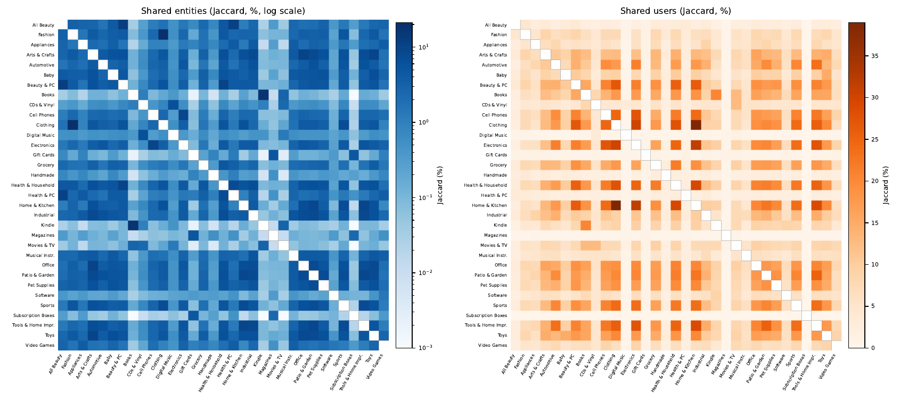

# Amazon-M3KG

**A Normalised Product Knowledge Graph Aligned with Text and Images for Cross-Domain Recommendation at Catalogue Scale.**

[](https://doi.org/10.5281/zenodo.22898760)

Amazon-M3KG turns the product metadata of [Amazon Reviews 2023](https://amazon-reviews-2023.github.io/)
into a normalised knowledge graph, aligned with the product text and image on a single
identifier, for 33 categories: 32.8 M products and 326 M triples. The graph is derived from
the metadata itself, not by linking to an encyclopaedia, so the same pipeline applies to any
category, including those DBpedia does not cover.

This repository holds the **code**: the construction pipeline, the normalisation rules, the
audit tool, the exporters (N-Triples, RecBole), the cross-domain analyses (shared entities,
shared users, dead links) and the head-to-head experiment against Amazon-KG v2.0.
The **data** (33 categories, RecBole splits, N-Triples) are deposited on Zenodo:
[10.5281/zenodo.22898760](https://doi.org/10.5281/zenodo.22898760).

## Quick start

```bash
pip install -r requirements.txt
export M3KG_DATA=data                 # folder holding meta_<CAT>.jsonl.gz (and <CAT>.jsonl.gz for reviews)

# 1. score the metadata keys of a category (which keys are usable relations)
python build_trimodal_kg.py discover -i $M3KG_DATA/meta_Baby_Products.jsonl.gz

# 2. build the category: two streaming passes (learn the value variants, then write)
python build_trimodal_kg.py build -c configs/categories.yaml \
       --category Baby_Products -i $M3KG_DATA/meta_Baby_Products.jsonl.gz -o out/

# 3. audit the produced graph, relation by relation
python audit_kg.py -o out/ --category Baby_Products

# 4. keep only tri-modal products and move the evaluation signals out of the graph
python finalize_outputs.py -o out/ --category Baby_Products

# 5. exports
python export_ntriples.py -o out/ --category Baby_Products
python export_recbole.py  -o out/ --category Baby_Products --reviews $M3KG_DATA/Baby_Products.jsonl.gz
```

`archive_categories.py` zips each category once built and appends it to the global archive.

## Files produced per category

| File | Content |
|---|---|
| `<CAT>.kg` | `subject TAB relation TAB value` — the graph; taxonomy edges after a `# taxonomie` line |
| `<CAT>.link` | `subject TAB product_id TAB n_homonyms TAB product_name` |
| `<CAT>.text` | `product_id TAB title + description` |
| `<CAT>.image` | `product_id TAB variant TAB URL` |
| `<CAT>.signal` | rating and popularity classes — aggregates over all reviews, kept **out** of the graph |
| `<CAT>.report.json` | per-relation statistics, tri-modal filter counts |
| `<CAT>.valuemap.json` | every learned merge (variant → canonical form), inspectable and reversible |
| `<CAT>.nt.gz` | N-Triples serialisation, schema.org alignment via `owl:equivalentProperty` |
| `recbole/<CAT>/` | `.inter` (user, item, rating, timestamp), frozen 5-core chronological splits, `.kg`, `.link` |

Subjects are `name ##product_id`: a product name does not identify a product (34.9 % of CDs
share their name with another item). Text is title plus description; images are URLs at
the best resolution the record offers (not redistributed as pixels, see Licence).

## Loading a category

Joining the three modalities is a three-way join on `product_id` through the `.link` file:

```python
from collections import defaultdict

prefixe = "out/Baby_Products"
def lire(ext):
    for ligne in open(prefixe + ext, encoding="utf-8"):
        if not ligne.startswith("#"):
            yield ligne.rstrip("\n").split("\t")

vers_pid = {s: pid for s, pid, _n, _nom in lire(".link")}      # subject -> product_id
triples = defaultdict(list)
for s, r, o in lire(".kg"):                                     # stops at the '# taxonomie' block
    if s in vers_pid:
        triples[vers_pid[s]].append((r, o))
texte  = {pid: t for pid, t in lire(".text")}
images = {pid: url for pid, _variant, url in lire(".image")}
```

The `.signal` file (rating and popularity classes) has the same layout as `.kg`; keep it for
analysis, never for training: its values aggregate all reviews, including the ones an
experiment puts in its test split.

For RDF tooling, `<CAT>.nt.gz` is a standard N-Triples serialisation (`rdflib`, Jena, GraphDB,
...): products are `<https://m3kg.example/product/<asin>>`, entities are keyed by (relation,
value), relations align with schema.org through `owl:equivalentProperty` where the meaning is
unambiguous.

## Construction cost

Construction is a two-pass stream (learn the value variants, then write) with bounded
memory, so cost is linear in the number of products: about 25,000 products per minute on one
laptop core under 400 MB. The largest category, Clothing, Shoes & Jewelry (7.2 M products),
takes about six hours; the whole resource is rebuildable overnight on a laptop, without a
cluster or a GPU. `scripts/run_build_batch.sh` runs several categories in parallel (one process
per category, disjoint lists).

## Layout

```
build_trimodal_kg.py                 pipeline: discover / build (two passes, declared operators)
audit_kg.py                          quality audit: under/over-normalisation, pollution, quasi-identifiers
finalize_outputs.py                  tri-modal filter, .signal split
export_ntriples.py                   RDF export
export_recbole.py                    interactions filtered to released products, 5-core, frozen splits
check_images.py                      URL form check + HTTP sample
measure_dead_links.py                dead-link rate, stratified, dated
fetch_images.py                      resumable image fetcher with failure log
analyze_overlap.py                   shared entities between categories (Jaccard, per relation)
analyze_shared_users.py              shared users between categories
build_amazonkg_subset.py             rebuild our graph on the exact items of Amazon-KG v2.0
archive_categories.py                one zip per category, then the global archive; raw files deleted after check
archive_reader.py                    read a category's files straight from the archive
configs/categories.yaml              one declared pipeline per relation, per category
configs/rules/*.json                 closed vocabularies: unit bins, title lexicons, role lists, ...
scripts/                             launchers (batch build, RecBole export, finalisation)
docs/                                full relation vocabulary, PNG figures of the section below
experiments/amazonkg_head_to_head/   RecBole configs, runner and results of the comparison
```

## Head-to-head with Amazon-KG v2.0

`experiments/amazonkg_head_to_head/` compares the two graphs on the **exact items and
interactions** of [Amazon-KG v2.0](https://github.com/WangYuhan-0520/Amazon-KG-v2.0-dataset):
our graph is rebuilt for those items alone (`build_amazonkg_subset.py`), their
`.inter` is used as is, and the same RecBole models (CKE, CFKG, KGCN, RippleNet), same
hyperparameters and the same three seeds run with either graph. `datasets/` holds our
subset graphs; Amazon-KG's own files are taken from their repository. Results are in
`results/*.json` and summarised in `final_results.md`.

```bash
cd experiments/amazonkg_head_to_head
python run_all.py --datasets M3KG-AKGsubset-Books M3KG-AKGsubset-Movies_and_TV
python collect_results.py
```

File names, identifiers and outputs are in English; comments and docstrings are in French.

<!-- SUPPLEMENT:BEGIN -->
## Supplementary material

Everything below is the supplementary material of the paper, computed from the deposited files (the tables are also in `Amazon-M3KG_supplement.pdf` on Zenodo). Numbers are those of the deposited version.

### Normalisation operators

The operators of the declared pipelines (Section 4 of the paper), with what each learns in the first pass and the default thresholds of the released configuration (`configs/categories.yaml`, `configs/rules/`).

**Table.** Normalisation operators. **Learns** states what the operator estimates from the corpus in the first pass; a dash means it applies a hand-written table. Thresholds are the defaults of the released configuration.

| Operator | Learns | Effect | Thresholds |
|---|---|---|---|
| *Value canonicalisation (learned)* |  |  |  |
| `canon_by_freq` | variant clusters | most frequent surface form per key (case, accents, punctuation; optionally spaces) | — |
| `fold_by_prefix` | prefix index | long value folded into a shorter, more frequent one it extends on whole words | min. count 3–10 |
| `fold_partial_names` | surname index | bare surname attached to its full name, only if unambiguous in the corpus | min. count 2 |
| `fold_plural` | attested pairs | singular/plural merged when both attested; taxonomic relations only | exceptions list |
| `split_smart` | fragment support | weak separator split only if each fragment is attested alone in the relation | min. evidence 3–5 |
| `match_learned` | value vocabulary | values learned on filled records sought in the titles of empty ones | min. count 3, ≥ 2 words |
| `min_support` | value counts | drops values below a support threshold | 2–5 |
| *Closed vocabularies (hand-written tables)* |  |  |  |
| `map` / `prefix_map` | — | explicit synonym or prefix table, applied on top of learned forms | rules files |
| `match_lexicon` / `match_subtype` | — | word *n*-gram lookup in a closed lexicon; sub-types nested under their type | 258 / 286 terms |
| `convert_measure` / `dimension_volume` | — | unit conversion then class; unknown unit rejected | bins per family |
| `parse_*_bin` | — | runtime, page count, age, price into named classes | AMPAS 40 / 240 min |
| `boolean_flag` | — | positive case only, under a value naming the fact | — |
| *Structural (declarative)* |  |  |  |
| `subsumed_by` | — | generic relation drops what specific ones stated | — |
| `fallback_for` | — | completion published only where the primary relation is empty | — |

### Statistics per category

From the `<CAT>.report.json` of the release; the paper shows the largest categories only.

**Table.** Amazon-M3KG statistics per category. Every published product carries all three modalities; **Kept** is the share of built products that passed this filter. **Rel.** is the number of relation types carrying at least one triple; **T/P** the mean number of triples per product, evaluation signals excluded (Section 3 of the paper); **Q** the audit score (Section 4.4 of the paper).

| Category | Products | Triples | Rel. | T/P | Kept | Q |
|---|---|---|---|---|---|---|
| Clothing Shoes & Jewelry | 7 207 737 | 68 367 779 | 32 | 9.49 | 99.9% | 99 |
| Home & Kitchen | 3 735 089 | 44 293 262 | 37 | 11.86 | 100.0% | 98 |
| Books | 3 047 740 | 26 148 055 | 11 | 8.58 | 69.3% | 95 |
| Automotive | 2 002 827 | 19 548 019 | 32 | 9.76 | 100.0% | 98 |
| Electronics | 1 609 424 | 16 647 989 | 37 | 10.34 | 100.0% | 97 |
| Sports & Outdoors | 1 586 701 | 16 860 140 | 48 | 10.63 | 100.0% | 97 |
| Tools & Home Improvement | 1 473 587 | 18 774 576 | 40 | 12.74 | 100.0% | 96 |
| Cell Phones & Accessories | 1 286 056 | 12 549 366 | 32 | 9.76 | 99.8% | 97 |
| Kindle Store | 1 167 233 | 13 658 434 | 13 | 11.70 | 73.4% | 99 |
| Beauty & Personal Care | 1 028 748 | 9 883 105 | 30 | 9.61 | 100.0% | 97 |
| Toys & Games | 890 770 | 8 605 683 | 37 | 9.66 | 100.0% | 99 |
| Patio Lawn & Garden | 851 766 | 8 960 141 | 41 | 10.52 | 100.0% | 98 |
| Amazon Fashion | 826 006 | 5 368 824 | 31 | 6.50 | 100.0% | 99 |
| Arts Crafts & Sewing | 801 044 | 7 617 168 | 30 | 9.51 | 100.0% | 98 |
| Health & Household | 797 302 | 7 909 215 | 36 | 9.92 | 100.0% | 98 |
| Office Products | 707 156 | 7 967 374 | 37 | 11.27 | 99.5% | 96 |
| CDs & Vinyl | 701 189 | 5 476 113 | 29 | 7.81 | 99.9% | 99 |
| Grocery & Gourmet Food | 603 117 | 4 708 152 | 36 | 7.81 | 100.0% | 99 |
| Pet Supplies | 492 710 | 4 479 405 | 32 | 9.09 | 100.0% | 98 |
| Industrial & Scientific | 427 436 | 3 899 130 | 38 | 9.12 | 100.0% | 97 |
| Movies & TV | 418 603 | 4 200 298 | 13 | 10.03 | 96.8% | 92 |
| Baby Products | 217 686 | 2 415 188 | 31 | 11.09 | 100.0% | 98 |
| Musical Instruments | 213 466 | 2 187 334 | 39 | 10.25 | 100.0% | 97 |
| Handmade Products | 164 805 | 1 112 360 | 19 | 6.75 | 100.0% | 100 |
| Video Games | 137 110 | 1 222 424 | 38 | 8.92 | 99.9% | 99 |
| All Beauty | 112 519 | 538 992 | 28 | 4.79 | 100.0% | 97 |
| Appliances | 94 315 | 845 936 | 35 | 8.97 | 100.0% | 99 |
| Software | 89 247 | 792 280 | 20 | 8.88 | 100.0% | 97 |
| Digital Music | 70 463 | 260 078 | 23 | 3.69 | 99.9% | 96 |
| Health & Personal Care | 60 264 | 249 214 | 35 | 4.14 | 100.0% | 99 |
| Magazine Subscriptions | 3 390 | 15 559 | 8 | 4.59 | 100.0% | — |
| Gift Cards | 1 136 | 4 685 | 16 | 4.12 | 99.9% | — |
| Subscription Boxes | 640 | 1 217 | 12 | 1.90 | 100.0% | 100 |
| **Total** | **32 827 282** | **325 567 495** |  |  |  |  |

### Effect of the normalisation additions per category

Comparison of the archived reports of the first build with the construction logs of the released one, both before the tri-modal filter. The second table gives the per-relation view on the two sparsest categories.

**Table.** Effect of the title lexicons, quantity classes, corpus-wide audience lexicon and subsumption on every category, before the tri-modal filter (evaluation signals excluded from both versions). T/P: triples per product before and after; Δ columns: triples gained by the lexicon relations and by the quantity classes, target-audience triples, triples removed by subsumption.

| Category | Products | T/P v1 | T/P v2 | Δ lexicons | Δ quantities | Audience | Subsumed |
|---|---|---|---|---|---|---|---|
| All Beauty | 112 577 | 4.06 | 4.79 | — | 39 454 | 44 212 (39 %) | — |
| Amazon Fashion | 826 049 | 2.30 | 6.50 | 2 629 300 | 184 253 | 778 424 (94 %) | — |
| Appliances | 94 318 | — | 8.97 | 58 926 | 111 487 | 1 307 (1 %) | — |
| Arts Crafts & Sewing | 801 384 | 8.20 | 9.51 | 4 | 928 983 | 149 336 (19 %) | — |
| Automotive | 2 003 030 | 8.51 | 9.76 | — | 2 458 538 | 123 446 (6 %) | — |
| Baby Products | 217 708 | 8.90 | 11.09 | 7 | 295 088 | 238 436 (110 %) | — |
| Beauty & Personal Care | 1 028 852 | 8.73 | 9.61 | — | 623 958 | 380 180 (37 %) | — |
| Books | 4 397 635 | 8.49 | 8.46 | — | — | — (0 %) | — |
| CDs & Vinyl | 701 925 | 6.89 | 7.81 | 170 663 | 441 571 | 18 691 (3 %) | — |
| Cell Phones & Accessories | 1 288 418 | 8.30 | 9.75 | — | 1 648 701 | 257 402 (20 %) | — |
| Clothing Shoes & Jewelry | 7 217 839 | — | 9.48 | 18 244 453 | 2 257 989 | 8 329 735 (115 %) | — |
| Digital Music | 70 530 | 2.96 | 3.69 | 36 519 | 9 298 | 2 727 (4 %) | — |
| Electronics | 1 609 896 | 8.89 | 10.34 | — | 2 136 382 | 285 493 (18 %) | — |
| Gift Cards | 1 137 | — | 4.12 | 13 | 81 | 20 (2 %) | — |
| Grocery & Gourmet Food | 603 217 | — | 7.81 | 31 297 | 360 136 | 30 795 (5 %) | — |
| Handmade Products | 164 805 | — | 6.75 | 138 | 10 544 | 117 547 (71 %) | — |
| Health & Household | 797 518 | — | 9.92 | 500 053 | 792 448 | 280 005 (35 %) | — |
| Health & Personal Care | 60 286 | — | 4.13 | 19 428 | 29 937 | 19 852 (33 %) | — |
| Home & Kitchen | 3 735 360 | — | 11.86 | 5 553 392 | 5 159 598 | 669 214 (18 %) | — |
| Industrial & Scientific | 427 536 | — | 9.12 | 405 763 | 353 671 | 47 637 (11 %) | — |
| Kindle Store | 1 591 371 | — | 11.59 | — | — | — (0 %) | — |
| Magazine Subscriptions | 3 391 | — | 4.59 | — | 13 | 105 (3 %) | — |
| Movies & TV | 432 592 | 9.98 | 9.98 | — | — | — (0 %) | 456 505 |
| Musical Instruments | 213 577 | — | 10.24 | 247 454 | 293 048 | 21 690 (10 %) | — |
| Office Products | 710 468 | — | 11.25 | 1 013 033 | 1 012 421 | 134 904 (19 %) | — |
| Patio Lawn & Garden | 851 873 | — | 10.52 | 901 849 | 986 402 | 75 396 (9 %) | — |
| Pet Supplies | 492 770 | — | 9.09 | 433 395 | 323 989 | 248 469 (50 %) | — |
| Software | 89 251 | — | 8.88 | 67 559 | 9 863 | 5 432 (6 %) | — |
| Sports & Outdoors | 1 587 291 | 9.33 | 10.62 | 51 | 1 632 565 | 1 019 827 (64 %) | — |
| Subscription Boxes | 640 | — | 1.90 | 47 | 23 | 193 (30 %) | — |
| Tools & Home Improvement | 1 473 731 | — | 12.74 | 2 232 900 | 2 065 374 | 155 567 (11 %) | — |
| Toys & Games | 890 832 | 9.23 | 9.66 | — | — | 480 774 (54 %) | — |
| Video Games | 137 259 | — | 8.91 | 34 450 | 186 181 | 7 186 (5 %) | — |

**Table.** Share of products carrying each attribute, before and after reading the title with a closed lexicon. **Before** uses the product record alone. Dashes mark relations that did not exist. The two categories are the sparsest of the corpus, which is why they were chosen.

| Category | Relation | Before | After |
|---|---|---|---|
| Amazon Fashion | Target audience | 14.5% | **95.3%** |
|  | Product type | — | **92.0%** |
|  | Colour | 1.9% | **78.7%** |
|  | Size | 1.0% | **55.0%** |
|  | Product sub-type | — | **53.7%** |
|  | Material | 3.4% | **42.9%** |
|  | *Triples per product* | *4.30* | ***8.36*** |
| Digital Music | Media format | — | **22.0%** |
|  | Release type | — | **16.3%** |
|  | Genre | 0.3% | **12.9%** |
|  | Artist | 67.2% | **71.2%** |
|  | *Triples per product* | *4.96* | ***5.69*** |

### Cross-domain overlap

Cross-domain overlap between all 33 categories, as Jaccard indices (%): shared entities (left, logarithmic colour scale, `hasMainCategory` excluded) and shared users (right). Computed by `analyze_overlap.py` and `analyze_shared_users.py` (the latter from the interaction files, i.e. counting only reviews on released products). Per-pair counts by relation are in `overlap.json`.



**Table.** Cross-domain overlap: Jaccard index (‰) between the entity sets of two categories, `hasMainCategory` excluded. Column labels abbreviate the row names. The full matrix with counts per relation is released with the data.

|  | AF | A | ACS | A | BP | BPC | B | CV | CPA | CSJ | DM | E | GC | GGF | HP | HH | HPC | HK | IS | KS | MS | MT | MI | OP | PLG | PS | S | SO | SB | THI | TG | VG |
|---|---|---|---|---|---|---|---|---|---|---|---|---|---|---|---|---|---|---|---|---|---|---|---|---|---|---|---|---|---|---|---|---|
| All Beauty | 31.9 | 28.6 | 28.0 | 15.6 | 42.2 | 120.2 | 0.3 | 2.7 | 10.7 | 17.5 | 5.1 | 12.9 | 6.8 | 23.6 | 7.2 | 45.3 | 106.9 | 10.9 | 25.9 | 0.3 | 3.3 | 0.4 | 25.2 | 18.9 | 20.2 | 29.3 | 3.9 | 12.6 | 3.0 | 12.7 | 25.5 | 28.8 |
| Amazon Fashion |  | 14.8 | 40.4 | 26.9 | 36.1 | 41.6 | 0.8 | 4.0 | 24.2 | 212.5 | 5.4 | 26.0 | 1.8 | 17.1 | 4.1 | 45.9 | 25.5 | 28.4 | 27.4 | 0.6 | 1.1 | 1.1 | 24.6 | 35.1 | 32.3 | 35.1 | 2.3 | 48.9 | 0.8 | 25.9 | 44.6 | 16.0 |
| Appliances |  |  | 23.1 | 19.0 | 34.6 | 16.1 | 0.2 | 1.6 | 8.8 | 8.7 | 3.6 | 12.4 | 8.5 | 16.9 | 7.3 | 22.1 | 42.5 | 12.0 | 42.2 | 0.1 | 2.9 | 0.1 | 37.4 | 20.9 | 31.0 | 28.0 | 3.6 | 13.5 | 3.4 | 18.5 | 23.7 | 37.3 |
| Arts Crafts & Sewing |  |  |  | 40.7 | 54.8 | 60.9 | 1.2 | 5.6 | 24.7 | 48.0 | 4.9 | 36.1 | 1.4 | 32.0 | 3.7 | 63.3 | 23.0 | 63.2 | 76.5 | 0.7 | 1.3 | 1.1 | 43.9 | 99.7 | 74.3 | 59.4 | 2.1 | 58.0 | 0.5 | 67.1 | 94.2 | 17.2 |
| Automotive |  |  |  |  | 28.2 | 35.7 | 1.2 | 6.0 | 26.7 | 32.9 | 4.3 | 47.3 | 1.0 | 14.8 | 2.2 | 44.7 | 16.6 | 35.7 | 58.5 | 0.8 | 1.0 | 1.0 | 24.8 | 37.5 | 58.2 | 33.5 | 2.1 | 50.8 | 0.3 | 57.1 | 39.2 | 15.5 |
| Baby Products |  |  |  |  |  | 45.3 | 0.6 | 3.9 | 19.9 | 29.6 | 5.4 | 24.7 | 3.4 | 32.9 | 6.9 | 52.3 | 42.3 | 33.2 | 48.0 | 0.4 | 2.3 | 0.6 | 43.5 | 50.3 | 50.7 | 56.5 | 3.3 | 35.9 | 1.2 | 34.5 | 64.4 | 27.9 |
| Beauty & Personal Care |  |  |  |  |  |  | 1.3 | 7.0 | 24.9 | 52.8 | 5.9 | 36.0 | 1.2 | 29.9 | 3.3 | 98.5 | 40.0 | 44.5 | 41.5 | 1.0 | 1.0 | 1.4 | 26.1 | 46.0 | 50.4 | 47.0 | 1.9 | 39.5 | 0.5 | 40.6 | 50.4 | 15.7 |
| Books |  |  |  |  |  |  |  | 10.4 | 0.9 | 1.9 | 3.8 | 1.4 | 0.0 | 1.0 | 0.1 | 1.3 | 0.3 | 2.4 | 0.9 | 179.3 | 0.1 | 29.1 | 0.6 | 1.3 | 1.1 | 0.7 | 0.3 | 1.8 | 0.0 | 1.6 | 1.4 | 0.4 |
| CDs & Vinyl |  |  |  |  |  |  |  |  | 4.1 | 7.8 | 61.4 | 5.9 | 0.3 | 5.8 | 0.6 | 6.9 | 2.3 | 7.0 | 4.4 | 9.6 | 0.3 | 23.9 | 3.7 | 5.2 | 5.7 | 4.2 | 0.8 | 7.6 | 0.1 | 6.1 | 5.9 | 2.1 |
| Cell Phones & Accessories |  |  |  |  |  |  |  |  |  | 25.8 | 3.1 | 92.7 | 0.8 | 11.2 | 1.5 | 27.9 | 10.3 | 24.2 | 22.4 | 0.7 | 0.6 | 0.9 | 19.2 | 29.2 | 24.4 | 21.5 | 1.4 | 28.8 | 0.3 | 26.3 | 26.3 | 19.4 |
| Clothing Shoes & Jewelry |  |  |  |  |  |  |  |  |  |  | 5.3 | 35.2 | 0.7 | 14.7 | 3.2 | 51.3 | 12.5 | 57.8 | 25.9 | 1.5 | 0.5 | 2.1 | 17.5 | 42.5 | 41.6 | 33.1 | 1.5 | 68.9 | 0.2 | 39.8 | 49.4 | 8.9 |
| Digital Music |  |  |  |  |  |  |  |  |  |  |  | 3.7 | 1.5 | 6.1 | 2.0 | 5.9 | 4.5 | 2.9 | 4.6 | 4.4 | 1.0 | 12.0 | 5.6 | 4.3 | 4.3 | 4.5 | 2.2 | 4.1 | 0.6 | 3.4 | 5.6 | 4.6 |
| Electronics |  |  |  |  |  |  |  |  |  |  |  |  | 0.8 | 13.5 | 1.5 | 43.4 | 13.0 | 41.2 | 42.7 | 0.9 | 0.7 | 1.1 | 30.3 | 47.5 | 41.2 | 30.0 | 2.6 | 44.5 | 0.3 | 51.4 | 42.5 | 29.7 |
| Gift Cards |  |  |  |  |  |  |  |  |  |  |  |  |  | 2.5 | 8.6 | 1.7 | 11.3 | 0.4 | 1.8 | 0.0 | 49.0 | 0.0 | 3.0 | 1.3 | 1.3 | 1.8 | 3.5 | 0.7 | 48.2 | 0.6 | 1.6 | 9.8 |
| Grocery & Gourmet Food |  |  |  |  |  |  |  |  |  |  |  |  |  |  | 3.5 | 48.3 | 33.1 | 18.2 | 27.5 | 0.7 | 1.3 | 0.9 | 20.8 | 24.8 | 28.3 | 29.6 | 2.6 | 18.6 | 1.1 | 16.8 | 37.2 | 13.7 |
| Handmade Products |  |  |  |  |  |  |  |  |  |  |  |  |  |  |  | 4.0 | 9.8 | 2.9 | 3.6 | 0.1 | 5.2 | 0.0 | 4.1 | 3.0 | 2.7 | 3.9 | 3.1 | 1.9 | 2.6 | 1.5 | 3.7 | 7.6 |
| Health & Household |  |  |  |  |  |  |  |  |  |  |  |  |  |  |  |  | 72.7 | 53.4 | 67.5 | 0.9 | 1.3 | 1.2 | 30.1 | 55.7 | 63.0 | 54.3 | 2.4 | 51.2 | 0.6 | 51.2 | 58.5 | 18.6 |
| Health & Personal Care |  |  |  |  |  |  |  |  |  |  |  |  |  |  |  |  |  | 9.4 | 33.6 | 0.2 | 4.8 | 0.3 | 27.2 | 18.4 | 20.8 | 30.9 | 4.6 | 12.9 | 4.7 | 12.0 | 25.8 | 36.3 |
| Home & Kitchen |  |  |  |  |  |  |  |  |  |  |  |  |  |  |  |  |  |  | 40.6 | 1.5 | 0.3 | 1.7 | 18.7 | 68.3 | 86.1 | 38.1 | 0.9 | 70.9 | 0.1 | 90.9 | 57.6 | 7.0 |
| Industrial & Scientific |  |  |  |  |  |  |  |  |  |  |  |  |  |  |  |  |  |  |  | 0.5 | 1.2 | 0.7 | 51.2 | 71.3 | 76.7 | 54.1 | 2.3 | 50.1 | 0.6 | 81.0 | 59.0 | 24.0 |
| Kindle Store |  |  |  |  |  |  |  |  |  |  |  |  |  |  |  |  |  |  |  |  | 0.1 | 30.3 | 0.4 | 0.8 | 0.7 | 0.4 | 0.3 | 1.2 | 0.0 | 0.9 | 0.9 | 0.3 |
| Magazine Subscriptions |  |  |  |  |  |  |  |  |  |  |  |  |  |  |  |  |  |  |  |  |  | 0.1 | 1.4 | 1.0 | 0.9 | 1.1 | 3.4 | 0.6 | 23.6 | 0.6 | 1.7 | 5.1 |
| Movies & TV |  |  |  |  |  |  |  |  |  |  |  |  |  |  |  |  |  |  |  |  |  |  | 0.6 | 1.0 | 1.0 | 0.7 | 0.3 | 1.8 | 0.0 | 1.0 | 1.4 | 0.5 |
| Musical Instruments |  |  |  |  |  |  |  |  |  |  |  |  |  |  |  |  |  |  |  |  |  |  |  | 40.6 | 39.9 | 39.6 | 4.1 | 28.8 | 1.1 | 28.9 | 44.9 | 35.1 |
| Office Products |  |  |  |  |  |  |  |  |  |  |  |  |  |  |  |  |  |  |  |  |  |  |  |  | 71.8 | 50.8 | 2.7 | 60.0 | 0.4 | 66.5 | 78.4 | 19.4 |
| Patio Lawn & Garden |  |  |  |  |  |  |  |  |  |  |  |  |  |  |  |  |  |  |  |  |  |  |  |  |  | 69.1 | 1.7 | 68.2 | 0.5 | 86.8 | 72.5 | 16.1 |
| Pet Supplies |  |  |  |  |  |  |  |  |  |  |  |  |  |  |  |  |  |  |  |  |  |  |  |  |  |  | 2.4 | 48.0 | 0.8 | 43.0 | 57.7 | 20.4 |
| Software |  |  |  |  |  |  |  |  |  |  |  |  |  |  |  |  |  |  |  |  |  |  |  |  |  |  |  | 1.4 | 1.1 | 1.1 | 4.2 | 13.4 |
| Sports & Outdoors |  |  |  |  |  |  |  |  |  |  |  |  |  |  |  |  |  |  |  |  |  |  |  |  |  |  |  |  | 0.2 | 73.9 | 56.3 | 11.1 |
| Subscription Boxes |  |  |  |  |  |  |  |  |  |  |  |  |  |  |  |  |  |  |  |  |  |  |  |  |  |  |  |  |  | 0.2 | 0.7 | 3.6 |
| Tools & Home Improvement |  |  |  |  |  |  |  |  |  |  |  |  |  |  |  |  |  |  |  |  |  |  |  |  |  |  |  |  |  |  | 51.9 | 10.9 |
| Toys & Games |  |  |  |  |  |  |  |  |  |  |  |  |  |  |  |  |  |  |  |  |  |  |  |  |  |  |  |  |  |  |  | 27.3 |

**Table.** Users shared between categories (thousands), counting only interactions on released products. Diagonal: users of the category. Column labels abbreviate the row names.

|  | AB | AF | A | ACS | A | BP | BPC | B | CV | CPA | CSJ | DM | E | GC | GGF | HP | HH | HPC | HK | IS | KS | MS | MT | MI | OP | PLG | PS | S | SO | SB | THI | TG | VG |
|---|---|---|---|---|---|---|---|---|---|---|---|---|---|---|---|---|---|---|---|---|---|---|---|---|---|---|---|---|---|---|---|---|---|
| All Beauty | **632** | 116.4 | 58.1 | 178.9 | 175.5 | 119.2 | 428.7 | 204.4 | 45.0 | 292.1 | 478.6 | 3.3 | 355.5 | 6.9 | 232.9 | 28.6 | 357.4 | 34.0 | 471.2 | 119.1 | 86.7 | 3.1 | 85.8 | 49.1 | 236.6 | 216.0 | 221.4 | 58.1 | 256.1 | 0.9 | 292.8 | 225.0 | 66.3 |
| Amazon Fashion |  | **2035** | 175.8 | 526.3 | 597.2 | 367.2 | 1055.4 | 669.3 | 147.5 | 929.8 | 1695.4 | 10.5 | 1156.6 | 20.1 | 667.9 | 96.5 | 1047.0 | 76.4 | 1517.6 | 347.8 | 289.6 | 8.6 | 285.0 | 165.0 | 727.2 | 708.4 | 683.7 | 188.6 | 891.0 | 2.3 | 942.9 | 764.2 | 222.1 |
| Appliances |  |  | **1756** | 385.4 | 740.1 | 243.6 | 703.6 | 538.8 | 127.8 | 789.0 | 1143.9 | 8.4 | 1121.8 | 18.2 | 579.9 | 46.7 | 902.7 | 58.2 | 1290.1 | 430.5 | 250.9 | 8.6 | 245.3 | 161.5 | 639.8 | 803.5 | 580.3 | 200.3 | 766.0 | 1.3 | 1021.0 | 537.0 | 193.1 |
| Arts Crafts & Sewing |  |  |  | **4623** | 1222.0 | 666.8 | 1973.5 | 1529.5 | 300.8 | 1768.3 | 3056.4 | 21.5 | 2451.7 | 38.2 | 1374.0 | 150.3 | 2142.6 | 132.5 | 3241.5 | 858.0 | 683.7 | 18.6 | 592.1 | 352.6 | 1703.5 | 1564.1 | 1428.2 | 420.5 | 1694.4 | 4.3 | 2071.0 | 1630.5 | 458.0 |
| Automotive |  |  |  |  | **8019** | 769.6 | 2411.9 | 1677.3 | 400.3 | 3184.7 | 4564.5 | 26.0 | 4603.7 | 46.2 | 1715.7 | 157.0 | 3031.6 | 159.4 | 4702.7 | 1434.0 | 739.1 | 20.4 | 776.1 | 573.2 | 2054.9 | 2739.5 | 1963.9 | 596.2 | 3083.6 | 3.8 | 3864.1 | 1877.7 | 766.8 |
| Baby Products |  |  |  |  |  | **3385** | 1386.5 | 978.5 | 152.8 | 1237.1 | 2242.0 | 8.9 | 1615.9 | 23.5 | 881.2 | 105.8 | 1477.0 | 87.1 | 2346.7 | 458.7 | 380.5 | 9.9 | 344.5 | 191.2 | 997.4 | 972.9 | 922.3 | 226.7 | 1182.5 | 2.8 | 1338.5 | 1491.4 | 287.3 |
| Beauty & Personal Care |  |  |  |  |  |  | **11325** | 2762.9 | 553.2 | 3945.5 | 7190.2 | 36.3 | 5198.8 | 66.2 | 2919.7 | 281.3 | 4871.9 | 258.2 | 7176.9 | 1372.7 | 1243.9 | 29.6 | 1049.0 | 598.1 | 2986.8 | 2955.4 | 2924.4 | 719.9 | 3478.5 | 7.5 | 4055.7 | 2903.6 | 840.3 |
| Books |  |  |  |  |  |  |  | **9174** | 819.6 | 2520.3 | 4764.3 | 55.0 | 4044.9 | 55.7 | 2145.0 | 185.6 | 3284.5 | 176.4 | 5052.6 | 1035.0 | 2427.4 | 37.3 | 1414.7 | 549.5 | 2375.6 | 2277.6 | 2033.5 | 800.6 | 2679.8 | 5.7 | 2938.7 | 2354.4 | 718.8 |
| CDs & Vinyl |  |  |  |  |  |  |  |  | **1750** | 511.9 | 934.6 | 59.3 | 885.5 | 15.2 | 466.9 | 38.8 | 668.6 | 43.3 | 974.1 | 237.1 | 298.7 | 12.3 | 565.7 | 176.4 | 492.3 | 485.0 | 401.5 | 185.0 | 546.1 | 1.3 | 626.1 | 442.7 | 198.3 |
| Cell Phones & Accessories |  |  |  |  |  |  |  |  |  | **11595** | 6774.5 | 31.6 | 6398.4 | 63.2 | 2415.8 | 232.5 | 4302.3 | 216.7 | 6789.7 | 1474.9 | 1238.1 | 25.0 | 1036.2 | 711.4 | 2962.5 | 2969.3 | 2724.6 | 847.8 | 3775.6 | 6.4 | 4357.3 | 2794.1 | 1136.5 |
| Clothing Shoes & Jewelry |  |  |  |  |  |  |  |  |  |  | **22548** | 59.6 | 9481.7 | 95.2 | 4449.7 | 448.8 | 7597.1 | 340.0 | 12847.4 | 2199.9 | 2288.0 | 42.1 | 1792.8 | 1051.7 | 4794.9 | 5184.8 | 4759.6 | 1275.4 | 6386.2 | 10.8 | 7138.5 | 5109.4 | 1489.5 |
| Digital Music |  |  |  |  |  |  |  |  |  |  |  | **101** | 57.0 | 1.1 | 32.4 | 2.9 | 44.4 | 3.4 | 62.2 | 16.9 | 18.3 | 1.0 | 43.1 | 13.7 | 34.3 | 31.2 | 24.5 | 12.0 | 34.3 | 0.1 | 40.8 | 29.3 | 12.6 |
| Electronics |  |  |  |  |  |  |  |  |  |  |  |  | **18285** | 86.5 | 3526.5 | 295.6 | 6150.0 | 287.8 | 9984.1 | 2175.8 | 2058.1 | 38.5 | 1667.3 | 1126.7 | 4274.4 | 4525.6 | 3771.1 | 1325.0 | 5473.6 | 8.7 | 6591.1 | 3930.3 | 1703.3 |
| Gift Cards |  |  |  |  |  |  |  |  |  |  |  |  |  | **133** | 54.4 | 5.2 | 75.7 | 6.5 | 96.7 | 31.7 | 25.6 | 1.5 | 28.0 | 13.0 | 57.9 | 53.8 | 45.6 | 22.2 | 59.4 | 0.2 | 69.1 | 54.9 | 22.1 |
| Grocery & Gourmet Food |  |  |  |  |  |  |  |  |  |  |  |  |  |  | **7032** | 189.4 | 3477.7 | 196.3 | 4857.8 | 1094.1 | 993.1 | 27.2 | 876.0 | 445.0 | 2134.8 | 2328.4 | 2080.2 | 577.3 | 2455.1 | 6.3 | 2936.7 | 1979.1 | 594.8 |
| Handmade Products |  |  |  |  |  |  |  |  |  |  |  |  |  |  |  | **587** | 284.9 | 19.0 | 449.9 | 92.7 | 79.1 | 2.3 | 71.9 | 41.6 | 205.5 | 215.7 | 210.1 | 43.6 | 230.2 | 0.7 | 267.0 | 220.8 | 53.0 |
| Health & Household |  |  |  |  |  |  |  |  |  |  |  |  |  |  |  |  | **12496** | 297.8 | 8114.2 | 1744.8 | 1521.6 | 35.2 | 1267.9 | 727.1 | 3462.3 | 3713.5 | 3340.7 | 896.2 | 4176.5 | 8.0 | 4977.1 | 3174.4 | 955.2 |
| Health & Personal Care |  |  |  |  |  |  |  |  |  |  |  |  |  |  |  |  |  | **462** | 355.8 | 114.4 | 78.3 | 3.2 | 79.8 | 45.3 | 193.8 | 195.0 | 177.2 | 54.3 | 217.5 | 0.6 | 248.5 | 167.3 | 55.0 |
| Home & Kitchen |  |  |  |  |  |  |  |  |  |  |  |  |  |  |  |  |  |  | **23235** | 2433.7 | 2421.7 | 44.8 | 1863.4 | 1088.5 | 5187.1 | 5867.1 | 5172.6 | 1335.6 | 6417.2 | 11.0 | 7959.3 | 5249.7 | 1517.8 |
| Industrial & Scientific |  |  |  |  |  |  |  |  |  |  |  |  |  |  |  |  |  |  |  | **3435** | 436.4 | 14.9 | 457.7 | 334.9 | 1288.1 | 1483.6 | 1094.2 | 336.9 | 1504.8 | 2.8 | 2018.5 | 1064.9 | 394.1 |
| Kindle Store |  |  |  |  |  |  |  |  |  |  |  |  |  |  |  |  |  |  |  |  | **5200** | 17.1 | 603.1 | 222.9 | 1047.7 | 1053.8 | 967.8 | 647.5 | 1217.3 | 2.9 | 1342.3 | 961.6 | 302.7 |
| Magazine Subscriptions |  |  |  |  |  |  |  |  |  |  |  |  |  |  |  |  |  |  |  |  |  | **60** | 18.9 | 6.3 | 27.9 | 27.4 | 23.4 | 11.5 | 28.0 | 0.1 | 32.4 | 23.5 | 8.5 |
| Movies & TV |  |  |  |  |  |  |  |  |  |  |  |  |  |  |  |  |  |  |  |  |  |  | **3244** | 253.0 | 930.5 | 908.7 | 791.6 | 379.0 | 1078.3 | 2.5 | 1195.4 | 924.4 | 420.6 |
| Musical Instruments |  |  |  |  |  |  |  |  |  |  |  |  |  |  |  |  |  |  |  |  |  |  |  | **1762** | 557.0 | 566.5 | 440.0 | 164.9 | 708.6 | 1.2 | 807.6 | 530.6 | 267.0 |
| Office Products |  |  |  |  |  |  |  |  |  |  |  |  |  |  |  |  |  |  |  |  |  |  |  |  | **7596** | 2451.9 | 2157.3 | 652.5 | 2747.9 | 5.8 | 3359.4 | 2276.8 | 748.0 |
| Patio Lawn & Garden |  |  |  |  |  |  |  |  |  |  |  |  |  |  |  |  |  |  |  |  |  |  |  |  |  | **8598** | 2581.7 | 665.7 | 3206.5 | 5.5 | 4231.0 | 2319.0 | 661.4 |
| Pet Supplies |  |  |  |  |  |  |  |  |  |  |  |  |  |  |  |  |  |  |  |  |  |  |  |  |  |  | **7778** | 562.1 | 2625.3 | 6.3 | 3177.0 | 2056.6 | 650.2 |
| Software |  |  |  |  |  |  |  |  |  |  |  |  |  |  |  |  |  |  |  |  |  |  |  |  |  |  |  | **2589** | 738.5 | 1.9 | 882.2 | 597.6 | 268.9 |
| Sports & Outdoors |  |  |  |  |  |  |  |  |  |  |  |  |  |  |  |  |  |  |  |  |  |  |  |  |  |  |  |  | **10330** | 6.1 | 4324.0 | 2806.4 | 951.1 |
| Subscription Boxes |  |  |  |  |  |  |  |  |  |  |  |  |  |  |  |  |  |  |  |  |  |  |  |  |  |  |  |  |  | **15** | 6.8 | 6.9 | 2.3 |
| Tools & Home Improvement |  |  |  |  |  |  |  |  |  |  |  |  |  |  |  |  |  |  |  |  |  |  |  |  |  |  |  |  |  |  | **12245** | 3077.2 | 1023.4 |
| Toys & Games |  |  |  |  |  |  |  |  |  |  |  |  |  |  |  |  |  |  |  |  |  |  |  |  |  |  |  |  |  |  |  | **8116** | 859.7 |
| Video Games |  |  |  |  |  |  |  |  |  |  |  |  |  |  |  |  |  |  |  |  |  |  |  |  |  |  |  |  |  |  |  |  | **2765** |

### Interactions and frozen splits

From the `.recbole.json` written by `export_recbole.py`. Splits are chronological per user, 80/10/10, on the 5-core; interaction files carry user, item, rating and timestamp.

**Table.** Interactions per category: reviews in Amazon Reviews 2023, share whose product is a released (tri-modal) product, resulting interaction file (one row per user–product pair), and the frozen 5-core used for the reference experiments.

| Category | Reviews | On released | `.inter` | 5-core inter. | Users | Items |
|---|---|---|---|---|---|---|
| All Beauty | 701 528 | 98.9 % | 693 771 | 2 535 | 253 | 356 |
| Amazon Fashion | 2 500 939 | 98.9 % | 2 474 047 | — | — | — |
| Appliances | 2 128 605 | 98.8 % | 2 103 915 | — | — | — |
| Arts Crafts & Sewing | 8 966 758 | 98.5 % | 8 836 509 | 1 784 358 | 197 064 | 89 870 |
| Automotive | 19 955 450 | 98.7 % | 19 690 699 | 6 071 369 | 632 070 | 267 246 |
| Baby Products | 6 028 884 | 98.7 % | 5 951 118 | 1 240 315 | 150 682 | 36 000 |
| Beauty & Personal Care | 23 911 390 | 98.7 % | 23 589 850 | 6 623 794 | 729 512 | 207 632 |
| Books | 29 475 453 | 83.9 % | 24 717 186 | 7 925 617 | 661 078 | 417 527 |
| CDs & Vinyl | 4 827 273 | 98.6 % | 4 759 600 | 1 546 836 | 123 302 | 89 207 |
| Cell Phones & Accessories | 20 812 945 | 98.7 % | 20 552 631 | 2 751 408 | 380 824 | 111 416 |
| Clothing Shoes & Jewelry | 66 033 346 | 98.7 % | 65 148 508 | 23 089 942 | 2 523 796 | 714 415 |
| Digital Music | 130 434 | 98.6 % | 128 645 | — | — | — |
| Electronics | 43 886 944 | 98.8 % | 43 360 211 | 15 470 984 | 1 640 795 | 368 129 |
| Gift Cards | 152 410 | 98.3 % | 149 885 | 2 429 | 377 | 129 |
| Grocery & Gourmet Food | 14 318 520 | 98.3 % | 14 074 130 | 3 945 202 | 404 422 | 132 772 |
| Handmade Products | 664 162 | 98.8 % | 656 070 | — | — | — |
| Health & Household | 25 631 345 | 98.6 % | 25 268 040 | 7 175 987 | 796 008 | 184 325 |
| Health & Personal Care | 494 121 | 98.8 % | 488 077 | — | — | — |
| Home & Kitchen | 67 409 944 | 98.8 % | 66 619 160 | 28 199 949 | 2 919 769 | 763 539 |
| Industrial & Scientific | 5 183 005 | 98.7 % | 5 115 685 | 412 909 | 50 980 | 25 845 |
| Kindle Store | 25 577 616 | 86.8 % | 22 197 620 | 13 928 955 | 791 807 | 407 653 |
| Magazine Subscriptions | 71 497 | 99.2 % | 70 910 | 176 | 30 | 21 |
| Movies & TV | 17 328 314 | 44.5 % | 7 710 726 | 3 040 362 | 232 401 | 103 741 |
| Musical Instruments | 3 017 439 | 98.6 % | 2 974 027 | 511 354 | 57 389 | 24 575 |
| Office Products | 12 845 712 | 98.5 % | 12 649 066 | 1 789 378 | 221 979 | 77 079 |
| Patio Lawn & Garden | 16 490 047 | 98.8 % | 16 287 642 | 3 439 185 | 416 430 | 133 414 |
| Pet Supplies | 16 827 862 | 98.6 % | 16 595 995 | 5 276 541 | 594 724 | 114 604 |
| Software | 4 880 181 | 98.9 % | 4 828 463 | 1 276 831 | 146 395 | 17 590 |
| Sports & Outdoors | 19 595 170 | 98.7 % | 19 347 275 | 3 471 624 | 409 727 | 156 208 |
| Subscription Boxes | 16 216 | 98.3 % | 15 938 | — | — | — |
| Tools & Home Improvement | 26 982 256 | 98.8 % | 26 645 511 | 7 890 023 | 841 971 | 274 702 |
| Toys & Games | 16 260 406 | 98.7 % | 16 050 538 | 3 861 097 | 432 172 | 162 012 |
| Video Games | 4 624 615 | 98.5 % | 4 553 820 | 814 447 | 94 745 | 25 609 |

### Head-to-head graphs

Statistics of the four graphs of the comparison (RecBole files in `experiments/amazonkg_head_to_head/`) and the results table of the paper, from `experiments/amazonkg_head_to_head/results/`.

**Table.** The four graphs of the head-to-head: Amazon-KG v2.0 and Amazon-M3KG rebuilt on the same items. Triples per item count only triples whose head is an item; Amazon-KG also carries triples between intermediate entities.

| Category | Graph | Triples | Relations | Entities | Items with ≥ 1 triple | Triples/item |
|---|---|---|---|---|---|---|
| Books | Amazon-KG v2.0 | 80 684 | 20 | 35 995 | 8 696 (100.0%) | 8.00 |
| Books | Amazon-M3KG | 74 387 | 11 | 17 425 | 8 693 (100.0%) | 8.56 |
| Movies & TV | Amazon-KG v2.0 | 151 515 | 20 | 53 096 | 4 896 (100.0%) | 21.81 |
| Movies & TV | Amazon-M3KG | 65 249 | 13 | 25 988 | 4 792 (97.9%) | 13.62 |

**Table.** Head-to-head on the exact items and interactions of Amazon-KG v2.0: the same model, the same splits, either graph. Recall@20 and NDCG@20 on the test split, mean±std over 3 seeds; bold marks the better graph when the gap exceeds both standard deviations. KGNNLS coincides with KGCN on binarised interactions and is not reported separately.

| Model | Books Recall@20 A-KG | Books Recall@20 M3KG | Books NDCG@20 A-KG | Books NDCG@20 M3KG | Movies & TV Recall@20 A-KG | Movies & TV Recall@20 M3KG | Movies & TV NDCG@20 A-KG | Movies & TV NDCG@20 M3KG |
|---|---|---|---|---|---|---|---|---|
| CKE | 0.1718 ±0.0009 | 0.1718 ±0.0025 | 0.0800 ±0.0004 | 0.0796 ±0.0018 | 0.1590 ±0.0060 | 0.1592 ±0.0040 | 0.0711 ±0.0039 | 0.0703 ±0.0017 |
| CFKG | 0.1598 ±0.0027 | **0.1652** ±0.0015 | 0.0729 ±0.0020 | **0.0757** ±0.0012 | **0.1657** ±0.0022 | 0.1575 ±0.0079 | 0.0741 ±0.0012 | 0.0699 ±0.0043 |
| KGCN | **0.1415** ±0.0030 | 0.1338 ±0.0033 | **0.0620** ±0.0013 | 0.0587 ±0.0020 | 0.1382 ±0.0052 | 0.1330 ±0.0069 | 0.0598 ±0.0026 | 0.0574 ±0.0013 |
| RippleNet | 0.0933 ±0.0053 | 0.0927 ±0.0030 | 0.0384 ±0.0024 | 0.0382 ±0.0008 | **0.1099** ±0.0022 | 0.0854 ±0.0078 | **0.0475** ±0.0007 | 0.0360 ±0.0031 |

### Relation vocabulary

Relations carried by at least three categories; the complete per-category vocabulary with distinct-value counts is in [`docs/full_vocabulary.md`](docs/full_vocabulary.md).

**Table.** Relation vocabulary: relations carried by at least three categories, with the number of categories, the total number of triples, the metadata keys they are read from, and the schema.org property they align with when one exists unambiguously. The full vocabulary per category (166 relations) is in the supplementary material.

| Relation | Cat. | Triples | Source keys | schema.org |
|---|---|---|---|---|
| `hasMainCategory` | 33 | 30 485 228 | main_category | — |
| `hasBrand` | 30 | 25 648 853 | Brand, Brand Name, Manufacturer, … | schema:brand |
| `hasTargetAudience` | 30 | 13 912 693 | Department, Target Audience, Gender, … | schema:audience |
| `hasWeightCategory` | 30 | 13 803 120 | Item Weight, Weight, Package Weight, … | schema:weight |
| `hasVolumeCategory` | 30 | 9 384 467 | Product Dimensions, Item Dimensions LxWxH, Item Dimensions LxWxH, … | — |
| `hasItemForm` | 30 | 1 272 745 | Item Form, Product Form, Format, … | — |
| `hasCategory` | 29 | 105 279 303 | categories | — |
| `hasPackSize` | 29 | 5 739 144 | Number of Items, Number Of Items, Number of Pieces, … | — |
| `hasAgeRange` | 29 | 2 633 386 | Age Range (Description), Age Range Description, Target Age Range, … | schema:suggestedAge |
| `hasAvailabilityStatus` | 29 | 202 607 | Is Discontinued By Manufacturer, Is Discontinued by Manufacturer | — |
| `hasPriceRange` | 28 | 9 622 744 | price | — |
| `hasCapacityCategory` | 28 | 617 073 | Capacity, Item Volume, Liquid Volume, … | — |
| `hasMaterial` | 27 | 12 563 024 | Material, Material Type, Fabric Type, … | schema:material |
| `hasSpecialFeature` | 27 | 6 512 112 | Special Feature, Special Features, Product Benefits, … | — |
| `hasStyle` | 27 | 6 022 239 | Style, Style Name, Theme, … | — |
| `hasCountryOfOrigin` | 27 | 2 020 542 | Country of Origin, Country/Region of Origin, Country/Region of origin, … | schema:countryOfOrigin |
| `hasReusability` | 26 | 353 651 | Reusability, Reusable | — |
| `hasColor` | 25 | 11 744 676 | Color, Colour, Color Name, … | schema:color |
| `hasMountingType` | 25 | 1 714 552 | Mounting Type, Installation Type, Installation Method | — |
| `hasIncludedComponent` | 25 | 1 690 379 | Included Components, Included Components?, What's in the box | — |
| `hasCareInstruction` | 24 | 1 577 205 | Care Instructions, Care instructions, Product Care Instructions, … | — |
| `hasPowerSource` | 24 | 825 398 | Power Source, Power Supply, Battery Type, … | — |
| `hasClosureType` | 24 | 698 492 | Closure Type, Closure, Fastening Type | — |
| `hasLoadCategory` | 24 | 261 015 | Maximum Weight Recommendation, Maximum weight recommendation, Maximum Weight Capacity, … | — |
| `hasBatteryRequirement` | 24 | 101 562 | Batteries Required?, Batteries required, Batteries Required | — |
| `hasFinish` | 23 | 1 834 907 | Finish Type, Finish, Exterior Finish, … | — |
| `hasBatteryInclusion` | 23 | 81 175 | Batteries Included?, Are Batteries Included, Batteries Included, … | — |
| `hasBladeLengthCategory` | 23 | 37 586 | Blade Length | — |
| `hasSize` | 20 | 4 769 770 | Size, Size Name, Item Size, … | schema:size |
| `hasLanguage` | 6 | 4 281 646 | Language, language | schema:inLanguage |
| `hasRoomType` | 6 | 1 334 323 | Room Type, Recommended Room | — |
| `hasSkinType` | 4 | 474 078 | Skin Type, Skin Tone, Hair Type | — |
| `hasFlavor` | 4 | 255 070 | Flavor, Flavor Name | — |
| `hasScent` | 4 | 252 341 | Scent, Flavor, Fragrance | — |
| `hasConnectivity` | 3 | 572 944 | Connectivity Technology, Wireless Communication Standard, Connector Type | — |
| `hasReleaseYear` | 3 | 330 761 | Release Date, Date first listed on Amazon | — |
| `hasGenre` | 3 | 297 338 | Genre, Style, title | schema:genre |
| `hasFitType` | 3 | 283 407 | Fit Type, Fit, Sleeve Type, … | — |
| `hasTargetSpecies` | 3 | 283 253 | Target Species | — |
| `hasFormFactor` | 3 | 226 067 | Form Factor | — |
| `hasControlType` | 3 | 217 489 | Control Console, Control Method, Controller Type | — |
| `hasPackaging` | 3 | 126 961 | Package Information, Package Type, Container Type | — |
| `hasOperatingSystem` | 3 | 119 628 | Operating System, OS | — |
| `hasSpecialty` | 3 | 79 955 | Specialty, Diet Type, Dietary Speciality | — |
| `hasCompatibleDevice` | 3 | 79 366 | Compatible Devices | — |

<!-- SUPPLEMENT:END -->

## Licence

Code: MIT. Derived data: CC BY 4.0. The upstream Amazon Reviews 2023 dumps are not
redistributed; images are distributed as URLs.

## Citation

The paper is under submission; until it is published, cite the resource as:

```bibtex
@misc{amazonm3kg2026,
  title        = {Amazon-M3KG: A Normalised Product Knowledge Graph Aligned with Text and Images for Cross-Domain Recommendation at Catalogue Scale},
  howpublished = {Submitted},
  year         = {2026}
}
```
